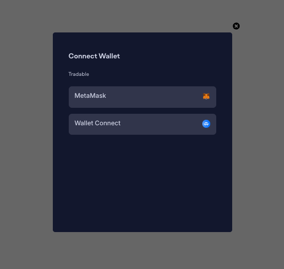
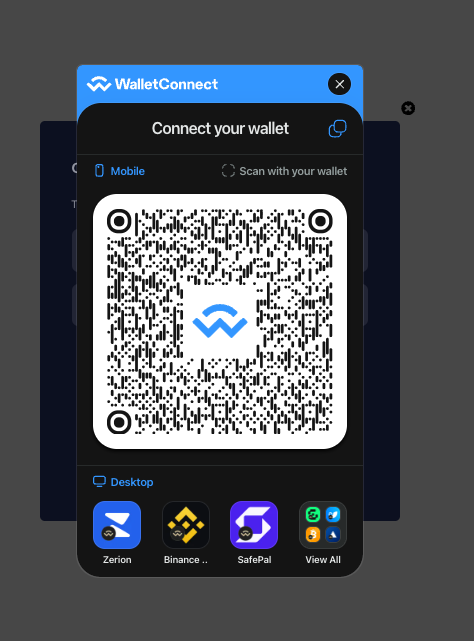
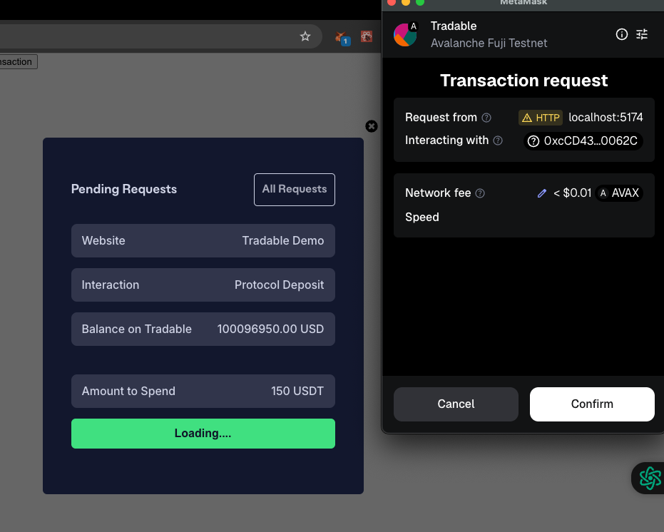
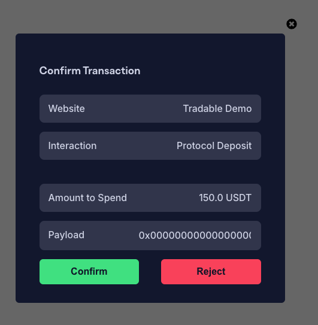
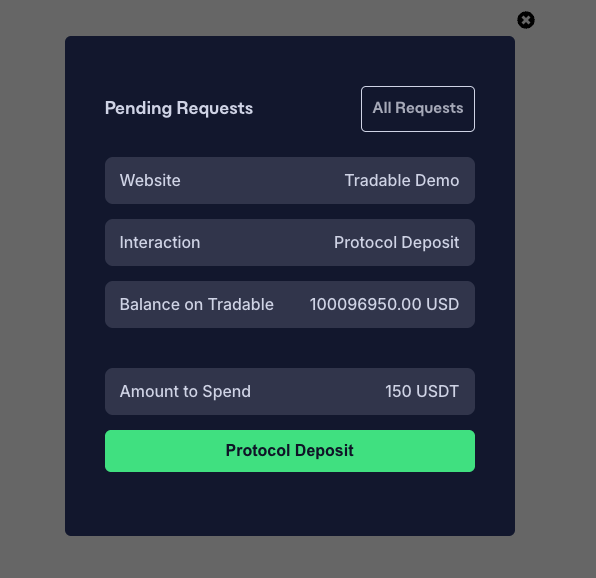
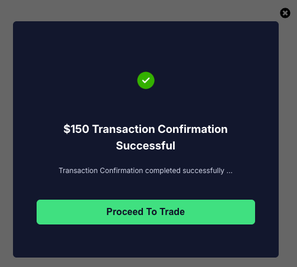

# Balance Module UI Components
This is a multichain decentralized payment solution that allows web3 projects to receive payment from user's with a simple integration process on the frontend as well as smart contract level.

## Installation
```bash
npm install
```

## Setup Your Environment Variables using ```.env-example``` && ```.env-example-local```
```bash
mv .env-example .env
```

```bash
mv .env-example-local .env.local
```

## Start Project
```bash
npm run dev
```

## Here are some interractions using this system

#### Wallet Connection Options


#### Wallet Connect


#### SDK Interaction List 


#### SDK Protocol Custom Interaction


#### SDK Protocol Custom Interaction Confirmation


#### SDK Protocol Deposit


#### SDK Success Message

